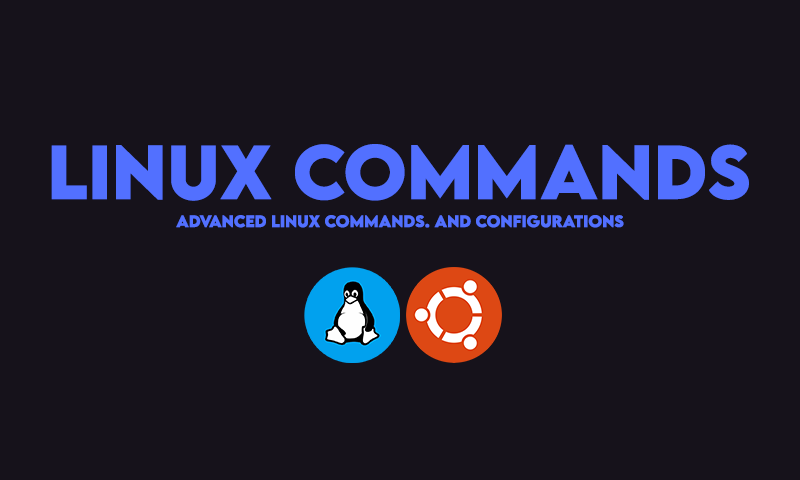

# Linux Admin Commands (Advanced and Basics).

**Following Project Includes**
- Linux Basics Commands for Handling Files.
- Network Basics.
- Package Management Commands with API Package Manager.
- Drive mount and Management commands. 
- File handling commands.
- SSH Commands (Comming Soon).

